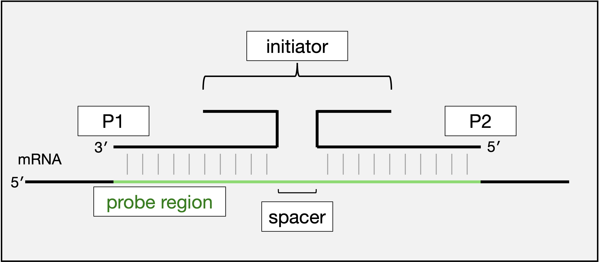
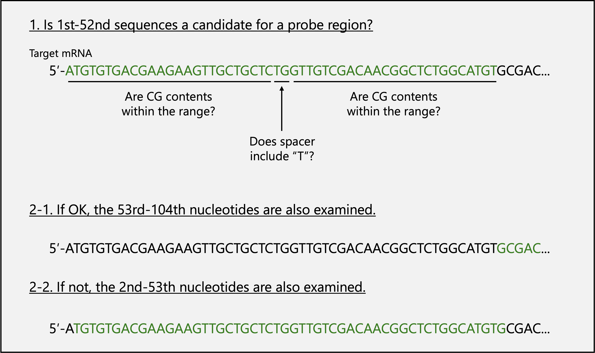

# Pipeline of split-initiator probe design

## I.	Workflow of Pipeline
1.	Obtain a table of target sequences that could be suitable for probes (First_ver1.R).
2.	Check for similar sequences in all RNAs except for the target (Blastn).
3.	Reverse complement to make mRNA binding sites and add the initiator sequence (Third_ver1.R).

## II.	Glossary

  

 Figure 1

- The ***probe region*** compromises a pair of probe binding sites and a ***spacer***. Since the probe binding site is 25 nt and the spacer is 2 nt, the probe region is 52 nt. 
- Of the probe pair, Probe1 (***P1***) is the 5′ end in mRNA, and Probe2 (***P2***) is the 3′ end. 
- Each probe has a part of the ***initiator*** sequence, and neighboring probes make the initiator sequence full-length. 

## III.	Criteria of mRNA binding site of probes
- GC contents are recommended to be 45-55%, and 40-60% is optional. 
- In the probe, “AA” bases connect the RNA binding site and the initiator as a linker. If the linker binds target mRNA, staining efficiency may be lower, so a probe region that the linker binds to mRNA (probe region including “T” in their spacer) is excluded as a default. 
- Designing with CDS of mRNA is recommended, and UTRs are optional.

## IV.	Overview of the First_ver1.R program

  

 Figure 2

1.	As shown in Fig. 2, the sequence 1st-52nd of the target mRNA is checked to determine whether it is a candidate for a Probe Region. In detail, the GC contents of probes are within the range, and the spacer does not include a “T”. 
2.	If the region passes the criteria, the region is selected as a candidate Probe Region, and the 53rd-104th nucleotides are examined. If not, the sequence from 2nd-53th is examined.
3.	Continue step 2 until you obtain the number of probe pairs.

## V.	The procedure for the First_ver1.R program
1.	Download the DNA sequence of the target mRNA and save it as a text file (.txt).
2.	Open “First_ver1.R” and write the file name with an absolute path in “RoadFileName”.
3.	Write the number of Probe Regions you want in “CandidateNum”. This program searches from the 5′ end, so the probe regions are biased to the 5. Therefore, a more extensive number of probes should be set than you want.
4.	Run the entire program. 
5.	The candidate sequences of the probe regions are output in fasta format. Information about the candidate Probe Regions is also output in text format. Details of the information file are below.

***Probe_Region_Sense*** is the mRNA sequence of the Probe Region that suits the condition (mRNA sequence is sense, and the complementary sequence to mRNA is antisense),  
***PRS GC Content*** is the GC content of the Probe Region,  
***P1_GC Content*** is the GC content of P1,  
***P2_GC Content*** is the GC content of P2,  
***StartBp_num*** indicates the location of the first base of the probe region, and  
***EndBp_num*** indicates the location of the end base. 

If you don’t get probe region enough…
- Relieve GC content condition. Set `gc_min` to 40 and `gc_max` to 60 in the line 11-12 of First_ver1.R. 
- Relieve linker (spacer) condition. Remove 
` & result[[7]] != "T" & result[[8]] != "T"`
in the line 66 of First_ver1.R.
- Search probe region in the UTR. 

## VI.	About Blastn
You can run the Blastn using the candidate sequences file (fasta) outputted in procedure 5, section V. 

## VII.	The procedure of the Third_ver1.R program
1.	Make a table of necessary probe regions. Remove rows of the unnecessary probe regions from the information file (txt file) outputted in procedure 5, section V. 
2.	Open Third_ver1.R. The R files for S45 or A161 hairpin DNA are available. 
3.	Write the table file name with an absolute path in “RegionFile”. 
4.	Run the entire program. 
5.	The Probe table is output as a CSV file. 

