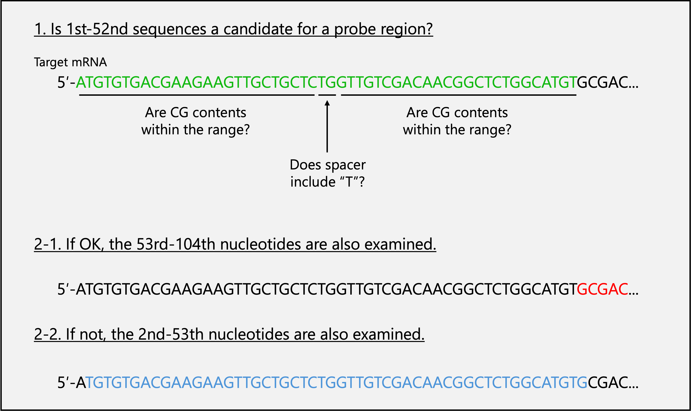

# Pipeline of split-initiator probe design

## I.	Workflow of Pipeline
1.	Find candidate regions for making probes in the target mRNA  (First_ver1.R).
2.	Check for similarities in all RNAs except for the target (Blastn).
3.	Add the initiator sequence (Third_ver1.R).

## II.	Glossary

  

 Figure 1

- The ***probe region*** compromises a pair of probe binding sites and a ***spacer***. Since the probe binding site is 25 nucleotide (nt) and the spacer is 2 nt, the probe region is 52 nt. 
- Of the probe pair, Probe1 (***P1***) is the 5′ end in mRNA, and Probe2 (***P2***) is the 3′ end. 
- Each probe has a part of the ***initiator*** sequence, and neighboring probes make the full initiator sequence. 

## III.	Criteria of mRNA binding site of probes
- GC contents are recommended to be 45-55%, and 40-60% is optional1. 
- In the probe, “AA” bases connect the RNA binding site and the initiator as a linker. If the linker binds to target mRNA, staining efficiency may be altered, so a probe region that the linker binds to mRNA (probe region including “T” in their spacer) is excluded as a default. 
- Designing with CDS of mRNA is recommended, and UTRs are optional2.

## IV.	Overview of the First_ver1.R program

  

 Figure 2

1.	As shown in Fig. 2, the 1st-52nd sequence of the target mRNA is checked to meet the requirements. 
2.	If the region meets them, it is selected as a candidate Probe Region, and the sequence shifted by 52 bases towards the 3′ end is examined. If not, the sequence shifted by 1 base is examined. 
3.	Continue step 2 until you obtain satisfactory numbers of probe regions. 

## V.	The procedure for the First_ver1.R program
1.	Download the DNA sequence of the target mRNA and save it as a text file (.txt).
2.	Open “First_ver1.R” and write the file name with an absolute path in “LoadFileName”.
3.	Write the number of Probe Regions you want in “CandidateNum”. This program searches from the 5′ end, so the probe regions are biased to the 5′. Therefore, a more extensive number of probes should be set than you want.
4.	Run the entire program. 
5.	The candidate sequences of the probe regions are output in fasta format. Information about the candidate Probe Regions is also output in text format. Details of the information file are below.

***Probe_Region_Sense*** is the mRNA sequence of the Probe Region. Sense means the same sequence as the target mRNA, 
***PRS GC Content*** is the GC content of the Probe Region,  
***P1_GC Content*** is the GC content of P1,  
***P2_GC Content*** is the GC content of P2,  
***StartBp_num*** indicates the location of the first base of the probe region, and  
***EndBp_num*** indicates the location of the end base. 

If you don’t get enough probe regions…
- Relieve GC content condition. Set `gc_min` to **40** and `gc_max` to **60 in the line 11-12** of First_ver1.R. 
- Relieve linker (spacer) condition. Remove 
` & result[[7]] != "T" & result[[8]] != "T"`
**in the line 66** of First_ver1.R.
- Search probe region in the UTR. 

## VI.	About Blastn
Since only an adjacent pair of probes can form the initiator sequence and trigger the amplification of the hairpin DNA2, we performed Blastn on the candidate probe regions, not individual probes. As the probe regions are sense sequences, we checked for +/+ fields in the Blastn results. The fasta file of probe region output in procedure 5, section V, can be used for the Blastn. 

## VII.	The procedure of the Third_ver1.R program
This program generates P1 and P2 by reverse-complementing and splitting the probe region and conjugating them with parts of the initiator sequence.
1.	Make a table of necessary probe regions. Remove rows of the unnecessary probe regions from the information file (.txt) output in procedure 5, section V. 
2.	Open Third_ver1.R. The R files for S45 or A161 hairpin DNA are available. 
3.	Write the table file name (.txt) with an absolute path in “RegionFile”. 
4.	Run the entire program. 
5.	The Probe table is output as a CSV file. 

## VIII. Reference
1. https://nepagene.jp/wp-content/uploads/ISHpalette_probe-design_v1-j.pdf
2. https://sites.google.com/view/in-situ-shhcr/faq
